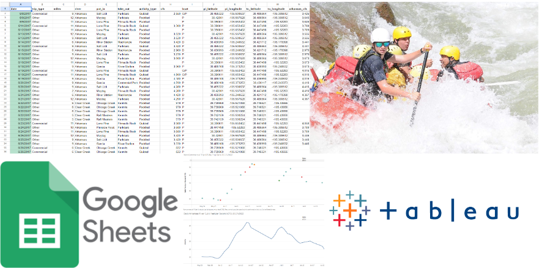

# River Miles Log Cleaning and Visualization Using Google Sheets and Tableau

## Project Overview
This project involves cleaning, exploring, and [visualizing](https://public.tableau.com/views/ColeJoseph_River_Log_Visualizations/Story1?:language=en-US&:display_count=n&:origin=viz_share_link) data from my personal River Miles Log. The log tracks information about every raft trip I participated in as a Whitewater Raft Guide, including date, miles traveled, type of trip, put-in and take-out location, water level, boat type, and activity type. Data was cleaned and aggregated in Google Sheets. Third-party water level data was downloaded from the US Geological Survey website and joined to the spreadsheet. Pivot tables were created to explore and visualize data using Google Sheets. Once data was thoroughly cleaned and explored, visualizations and dashboards were created using Tableau to illustrate patterns and trends within the data and to allow other users to explore and filter the data. 

## Installation and Setup

### Resources Used

Programs used: Google Sheets, Tableau, and Python.

Python version: Python 3.

## Data

Source data: The data used for this project is my personal River Miles Log sheet. It contains relevant data for every rafting trip I participated in from 2017 to 2022. This project also uses water level data for the Arkansas River, downloaded from the US Geological Survey website. 

Data acquisition: My original River Miles Log data can be accessed here[https://docs.google.com/spreadsheets/d/1tqPGxfS0T6j-5g5wazgPtsR3BmH9RXkueuPmdCjh3kQ/edit#gid=0]. The USGS water level data can be downloaded from their website. (https://waterdata.usgs.gov/monitoring-location/07094500/#parameterCode=00065&period=P7D&showMedian=true).

Preprocessing: The USGS water level data was filtered and aggregated using Python prior to uploading it to Google Sheets.

## Project Structure
1. [Original data (Google Sheets)](https://docs.google.com/spreadsheets/d/1tqPGxfS0T6j-5g5wazgPtsR3BmH9RXkueuPmdCjh3kQ/edit?usp=sharing)
2. [Cleaned data (Google Sheets)](https://docs.google.com/spreadsheets/d/1xvwZAN8gcWX6ytiDeq9__npj_mQatEYfLMnWygOJQ9w/edit?usp=sharing)
3. [Data visualizations (Tableau dashboards)](https://public.tableau.com/views/ColeJoseph_River_Log_Visualizations/Story1?:language=en-US&:display_count=n&:origin=viz_share_link)
4. [Data dictionary](River_Miles_Log_Data_Dictionary.pdf)
5. [Clean USGS CFS data](USGS_Arkansas_Daily_CFS_Clean.csv)
6. [Raw USGS CFS data](USGS_CFS.tsv)
7. [Cleaning and aggregating raw USGS data (Python)](USGS_CFS_Data_Cleaning.ipynb)

## Data Dictionary
Column and description
1. Date - the date of the trip
2. Trip_type - the type of trip specifies whether the trip was paid 
5. Miles - how many miles were covered on the river
6. River - the name of the river where the trip occurred
7. Put-in - the name of the put-in location where the trip started
8. Take-out - the name of the take-out location where the trip ended
9. Activity_type - specifies what type of activity I performed on the trip
11. Cubic Feet per Second (CFS) - the water level during that trip
12. Boat - the type of craft used for that trip 
13. PI_latitude - the latitude of the put-in location
14. PI_longitude - the longitude of the put-in location
15. TO_latitude - the latitude of the take-out location
16. TO_longitude - the longitude of the take-out location
17. Arkansas_cfs - water level data for the Arkansas River from the US Geological Survey, measured in cubic feet per second

## References
USGS Water level data: https://waterdata.usgs.gov/monitoring-location/07094500/#parameterCode=00065&period=P7D&showMedian=true
